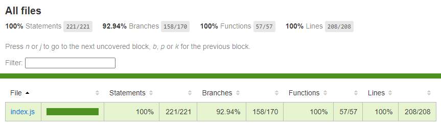

[English](./README.en-US.md) | 简体中文
## cron-quartz

一个生成 `quartz` 对应 cron 表达式的库
___

## 安装

``` bash
npm install cron-quartz --save-dev
```
___
## 使用方法

```
import Cron from 'cron-quartz';

const cron = new Cron();

// 生成秒钟的表达式
const result = cron.seconds({
  type: 'specific',
  list: [1, 2, 3],
});

console.log(result) // => '1,2,3 * * ? * * *'
```
___
## 表达式校验

如果想对生成的表达式进行校验，可以下载`cron-expression-validator`这个库，具体的方法可以查看库的说明文档。

## 单元测试

| Statements  | Branches | Functions | Lines  |
| ----------- | -------- | --------- | ------ |
|   100%      |  92.94%  |   100%    |  100%  |
|   221/221   | 158/170  |   57/57   | 208/208|


## API

#### `cron = new Cron()`

创建一个 cron 表达式实例

#### `cron.seconds(opts)`

生成`秒钟`对于表达式

* `opts.type`: 会有4种类型选择 `every` | `start` | `specific` | `between`
* `opts.list`: 是一个数组类型，除了选择`every`，其它为必填项

``` javascript
cron.seconds({ type: 'every' }) // => '* * * ? * * *'

cron.seconds({ type: 'start', list: [20, 40]}) // => '20/40 * * ? * * *'

cron.seconds({ type: 'specific', list: [20, 33, 44]}) // => '20,33,44 * * ? * * *'

cron.seconds({ type: 'between', list: [52, 20]}) // => '52-20 * * ? * * *'
```

#### `cron.minutes(opts)`

生成`分钟`对于表达式

* `opts.type`: 会有4种类型选择 `every` | `start` | `specific` | `between`
* `opts.list`: 是一个数组类型，除了选择`every`，其它为必填项

``` javascript
cron.minutes({ type: 'every' }) // => '* * * ? * * *'

cron.minutes({ type: 'start', list: [12, 32]}) // => '* 12/32 * ? * * *'

cron.minutes({ type: 'specific', list: [0]}) // => '* 0 * ? * * *'

cron.minutes({ type: 'between', list: [12, 32]}) // => '* 12-32 * ? * * *'
```

#### `cron.hours(opts)`

生成`小时`对于表达式

* `opts.type`: 会有4种类型选择 `every` | `start` | `specific` | `between`
* `opts.list`: 是一个数组类型，除了选择`every`，其它为必填项

``` javascript
cron.hours({ type: 'every' }) // => '* * * ? * * *'

cron.hours({ type: 'start', list: [17, 16]}) // => '* * 17/16 ? * * *'

cron.hours({ type: 'specific', list: [1, 14, 23]}) // => '* * 1,14,23 ? * * *'

cron.hours({ type: 'between', list: [12, 23]}) // => '* * 12-23 ? * * *'
```

#### `cron.days(opts)`

生成`天`对于表达式

* `opts.type`: 会有11种类型选择 `every` | `start` | `startOnMonth` | `specific` | `specificOnMonth` | `lastDayOnMonth` | `lastWeekOnMonth` | `lastSelectDayOnMonth` | `before` | `near` | `dayOnEveryMonth`
* `opts.list`: 是一个数组类型，除了选择`every` | `lastDayOnMonth` | `lastWeekOnMonth`，其它为必填项

``` javascript
cron.days({ type: 'every' }) // => '* * * ? * * *'

cron.days({ type: 'start', list: [2, 7]}) // => '* * * ? * 2/7 *'

cron.days({ type: 'startOnMonth', list: [9, 8]}) // => '* * * 9/8 * ? *'

cron.days({ type: 'specific', list: [2, 4, 6]}) // => '* * * ? * 2,4,6 *'

cron.days({ type: 'specificOnMonth', list: [1, 15, 23, 31]}) // => '* * * 1,15,23,31 * ? *'

cron.days({ type: 'lastDayOnMonth' }) // => '* * * L * ? *'

cron.days({ type: 'lastWeekOnMonth' }) // => '* * * LW * ? *'

cron.days({ type: 'lastSelectDayOnMonth', list: [2] }) // => '* * * ? * 2L *'

cron.days({ type: 'before', list: [15] }) // => '* * * L-15 * ? *'

cron.days({ type: 'near', list: [11] }) // => '* * * 11W * ? *'

cron.days({ type: 'dayOnEveryMonth', list: [1, 5] }) // => '* * * ? * 1#5 *'
```
#### `cron.months(opts)`

生成`月`对于表达式

* `opts.type`: 会有4种类型选择 `every` | `start` | `specific` | `between`
* `opts.list`: 是一个数组类型，除了选择`every`，其它为必填项

``` javascript
cron.months({ type: 'every' }) // => '* * * ? * * *'

cron.months({ type: 'start', list: [[3, 12]}) // => '* * * ? 3/12 * *'

cron.months({ type: 'specific', list: [1, 3, 4]}) // => '* * * ? 1,3,4 * *'

cron.months({ type: 'between', list: [12, 1]}) // => '* * * ? 12-1 * *'
```
#### `cron.years(opts)`

生成`年`对于表达式

* `opts.type`: 会有4种类型选择 `every` | `start` | `specific` | `between`
* `opts.list`: 是一个数组类型，除了选择`every`，其它为必填项

``` javascript
cron.years({ type: 'every' }) // => '* * * ? * * *'

cron.years({ type: 'start', list: [[2021, 1]}) // => '* * * ? * * 2021/1'

cron.years({ type: 'specific', list: [2020, 2021, 2022]}) // => '* * * ? * * 2020,2021,2022'

cron.years({ type: 'between', list: [2022, 2023]}) // => '* * * ? * * 2022-2023'
```
___
## License
____
(c) 2022 Evan(bnuephjx). MIT License
